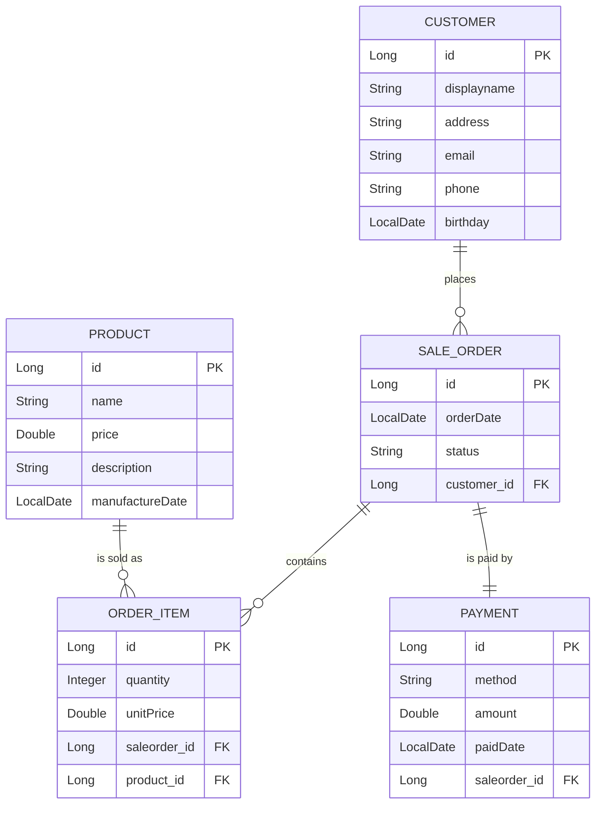

# Backend Assignment — Online Shop

A small shop backend built with Spring Boot, Spring Data JPA and an in-memory H2
database. Five entities, a DTO layer, and a REST API with Create / List /
Update (PATCH) / Delete.

---

## 1. Domain model



Plain text version:

```
Customer ---1:N--> SaleOrder ---1:N--> OrderItem <--N:1--- Product
                       |
                      1:1
                       v
                    Payment
```

### The five entities

| Entity | What it is | Key fields |
| --- | --- | --- |
| `Customer` | someone who buys | displayname, address, email, phone, birthday |
| `Product` | something the shop sells | name, price, description, manufactureDate |
| `SaleOrder` | one purchase | orderDate, status (NEW / PAID / SHIPPED / CANCELLED) |
| `OrderItem` | one line of an order | quantity, unitPrice |
| `Payment` | how one order was paid | method, amount, paidDate |

### The three relationships

| Type | Where | Why it is that way |
| --- | --- | --- |
| **One-to-Many** | `Customer` → `SaleOrder`, `SaleOrder` → `OrderItem` | one customer buys many times; one order has many lines. `mappedBy` says the foreign key lives on the *other* side, so the list is only a view of it. |
| **Many-to-One** | `SaleOrder` → `Customer`, `OrderItem` → `SaleOrder`, `OrderItem` → `Product` | this is the side that owns the foreign-key column (`customer_id`, `saleorder_id`, `product_id`). |
| **One-to-One** | `SaleOrder` ↔ `Payment` | an order is paid at most once. `Payment` owns the unique `saleorder_id`; `SaleOrder` points back with `mappedBy`. It is a separate entity rather than four more columns on `SaleOrder` so that an unpaid order simply has no payment row — no nulls to interpret. |

Two design decisions worth naming:

* **`OrderItem.unitPrice` is copied from the product at the time of sale.** If the
  shop changes a price tomorrow, old orders must still show what was actually
  paid, so the price is not read back from `Product` at display time.
* **`SaleOrder` cascades to its items and its payment** (`cascade = ALL`,
  `orphanRemoval = true`). They are *parts* of the order, not independent things:
  one `save()` writes all of them, and deleting the order deletes them.
  `Customer` and `Product` do **not** cascade — deleting an order must not delete
  the customer.

The table is called `sale_order` because `ORDER` is a reserved word in SQL.

---

## 2. The DTO layer

Every entity has a DTO in `th.camt.dto`, and the entities never leave the
controller. Each DTO is:

* **flat** — `SaleOrderDTO` has `customer_id` + `customer_name` instead of a
  nested `Customer` object, so the client draws an order in **one** request;
* **smaller** — `CustomerDTO` carries an `order_count` number, not the whole
  order history, so there is no `customer → order → customer` JSON loop to break
  with `@JsonIgnore`;
* **renamed** — the field `manufactureDate` is `"manufacture-date"` on the wire.
  A JSON name can change without touching a database column.

Every DTO field is an object type (`Integer`, `Double`, `Long`), never a
primitive — the partial update below works by skipping fields that are `null`,
and an `int` can never be null.

**Mapping** is done by MapStruct (`th.camt.dto.mapper`). I write the interface,
MapStruct generates the implementation at compile time — readable plain Java in
`web-service/target/generated-sources/annotations/`. The key annotation is:

```java
@BeanMapping(nullValuePropertyMappingStrategy = NullValuePropertyMappingStrategy.IGNORE)
void updateProductFromDto(ProductDTO dto, @MappingTarget Product entity);
```

`IGNORE` is what makes **PATCH** a merge instead of a replace: a body of
`{"price": 75.0}` changes the price and leaves the name and description alone.

---

## 3. REST API

Base path `/api`.

| Method | Path | Answer |
| --- | --- | --- |
| POST | `/products` | 201 + the created product |
| GET | `/products` | 200 + list |
| GET | `/products/{id}` | 200, or 404 |
| PATCH | `/products/{id}` | 200 + updated product, or 404 |
| DELETE | `/products/{id}` | 204, or 404 |
| POST | `/sale-orders` | 201 + the order with its lines and payment, or 400 for an unknown customer/product |
| GET | `/sale-orders` | 200 + list |
| GET | `/sale-orders/{id}` | 200, or 404 |
| PATCH | `/sale-orders/{id}` | 200 (typically `{"status":"SHIPPED"}`), or 404 |
| DELETE | `/sale-orders/{id}` | 204, or 404 |
| POST / GET | `/customers`, `/customers/{id}` | 201 / 200, or 404 |
| GET | `/payments`, `/sale-orders/{id}/payment` | 200, or 404 |

Creating an order:

```bash
curl -X POST http://localhost:8080/api/sale-orders \
  -H "Content-Type: application/json" \
  -d '{"customer_id":1,"status":"NEW",
       "items":[{"product_id":1,"quantity":2}],
       "payment_method":"CASH"}'
```

The server takes the unit price from the product, sums the lines itself, and
creates the payment together with the order — a client cannot invent its own
price.

---

## 4. Tests

`ProductControllerTest` and `SaleOrderControllerTest` — 10 test methods, all
using `MockMvc`, which calls the controllers through the real Spring MVC stack
(URL matching, JSON parsing, status codes) without opening a port.
`@Transactional` rolls each test back, so they cannot affect each other.

| Test | Covers |
| --- | --- |
| `createProductReturns201AndSavesIt` | **Create** — 201 and the row is really in the database |
| `listProductsReturnsAllProducts` | **List** |
| `patchProductChangesOnlyTheFieldsSent` | **Update (PATCH)** — the untouched fields survive |
| `deleteProductRemovesIt` | **Delete** — 204, then 404 |
| `patchUnknownProductReturns404` | 404 instead of a 500 |
| `createSaleOrderReturns201WithItemsCustomerAndPayment` | **Create** + all three relationships in one response |
| `listSaleOrdersReturnsCreatedOrder` | **List** |
| `patchSaleOrderChangesStatusOnly` | **Update (PATCH)** |
| `deleteSaleOrderRemovesItAndUnknownIdIs404` | **Delete** + 404 |
| `createSaleOrderWithUnknownCustomerReturns400` | 400 for a client mistake |

---

## 5. How to run

```bash
# from THIS folder (multi-module: domain-model must be built first)
mvn install -DskipTests
mvn test
mvn -pl web-service spring-boot:run
```

Service: <http://localhost:8080/api/products> ·
H2 console: <http://localhost:8080/h2-console>
(JDBC URL `jdbc:h2:mem:asgdb`, user `sa`, no password)

The database is **H2 in memory**: Hibernate creates the tables from the entities
on every start (`ddl-auto=create-drop`) and `data.sql` fills them with 10
customers, 10 products, 3 orders, 4 order lines and 2 payments. Restarting the
app resets everything.

### Project layout

```
domain-model/    th.camt.domain      the 5 entities (no Spring, no JSON)
web-service/     th.camt             controllers          port 8080
                 th.camt.repository  Spring Data repositories
                 th.camt.dto         DTOs
                 th.camt.dto.mapper  MapStruct mappers
web-front/       static web page (not used by this assignment)
```

`App` needs `@EntityScan("th.camt.domain")` because the entities live in the
other Maven module, outside the package Spring Boot scans by itself.

---

## 6. AI usage declaration

| Tool | Used for |
| --- | --- |
| Claude (Anthropic) | Drafting the entity / DTO / mapper / controller / test code from my domain design, and writing this README. |

What I did myself: chose the domain (shop / sale orders) and decided which entity
carries each relationship, chose the endpoint list and the status codes, reviewed
and ran all of the code, and verified every test passes locally before pushing.
